# Autowerkstatt Management System

Autowerkstatt is a comprehensive **car service management system** built with **Python Django**.  
It streamlines **car tracking**, **measurement recording**, **problem (DTC) management**, **user management**, and **reporting** with an intuitive web interface.

---

## 🚀 Features

### Authentication & Authorization
- Secure sign up / sign in / logout
- Password change
- Role-based access (admin / user)
- CSRF protection, session-based auth

### Car Management
- Create / edit / delete cars
- VIN-based uniqueness (recommended primary key)
- Owner-based search & filtering
- Slug support for clean URLs

### Measurement Management
- Create / edit / delete measurement records
- Link measurements to cars (One-to-Many)
- Rich details page per measurement
- Pagination for large lists

### Problem (DTC) Management
- Manage problems via a dedicated **Problem** model  
  (`ManyToManyField` from Measurement → Problem)
- Alternatively parse DTC codes from provided **TXT** files
- Display **code + description** pairs on detail pages

### Data Processing & Visualization
- **Pandas** for CSV ingestion (e.g., `measurements.csv`, `cars.csv`)
- **Plotly** for interactive time-series charts (BatteryVoltage, RPM, etc.)
- Timestamp normalization (ms → seconds) for readable axes

### UI & Templates
- Bootstrap-based responsive UI
- Template inheritance (`layout.html`), partials (`_nav.html`, `_messages.html`)
- Static files pipeline and global includes

---

## 🛠️ Technologies Used

- **Framework:** Python **Django**
- **Frontend:** HTML5, CSS3, JavaScript, **Bootstrap**
- **Data & Viz:** **Pandas**, **Plotly**
- **Database:** SQLite (dev) / PostgreSQL / MySQL (configurable)
- **Auth:** Django Authentication System
- **VCS:** Git & GitHub

---

## 📸 Screenshots

### 1) Home Dashboard
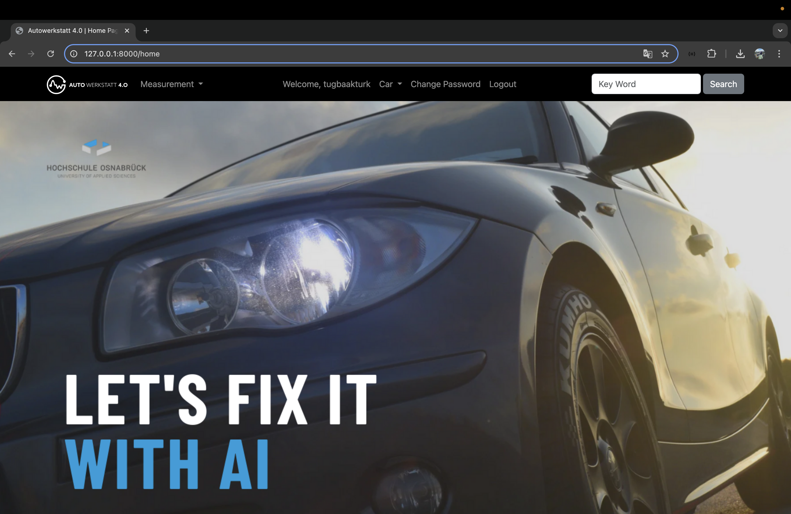

### 2) User Authentication
- **Login**
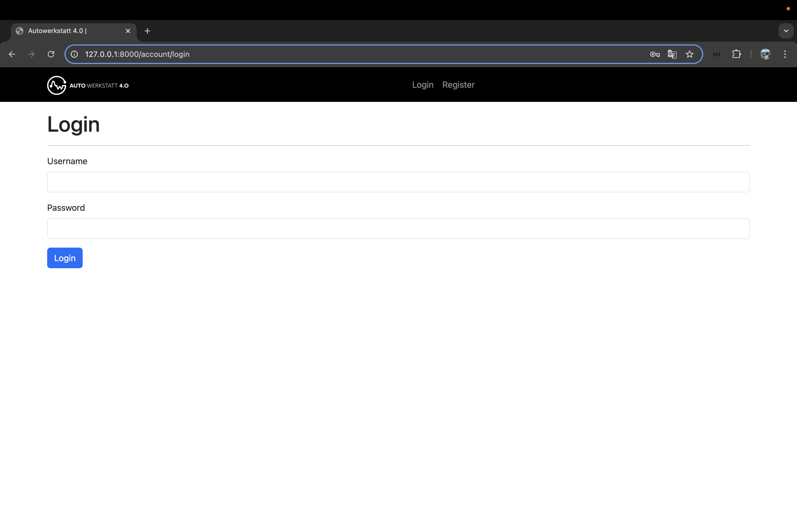
- **Register**
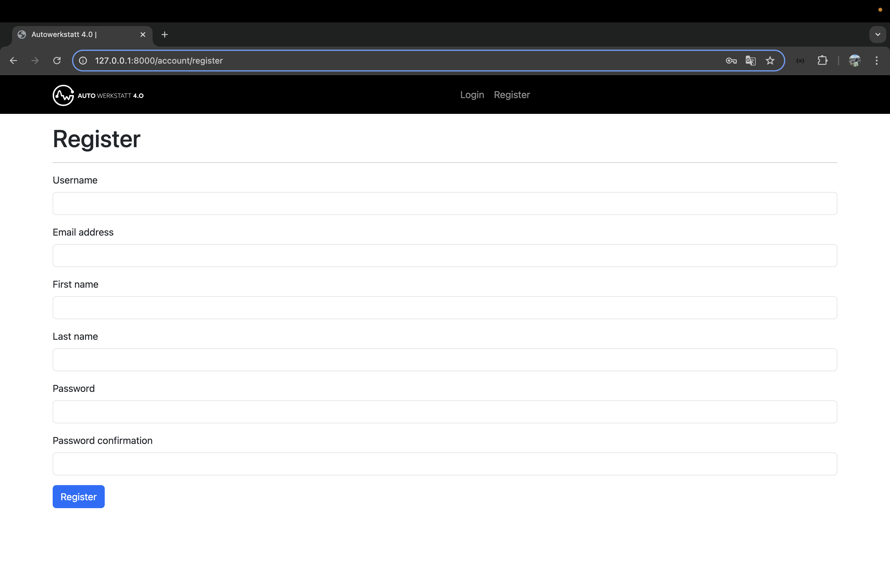

### 3) Car Management
- **Add Car**
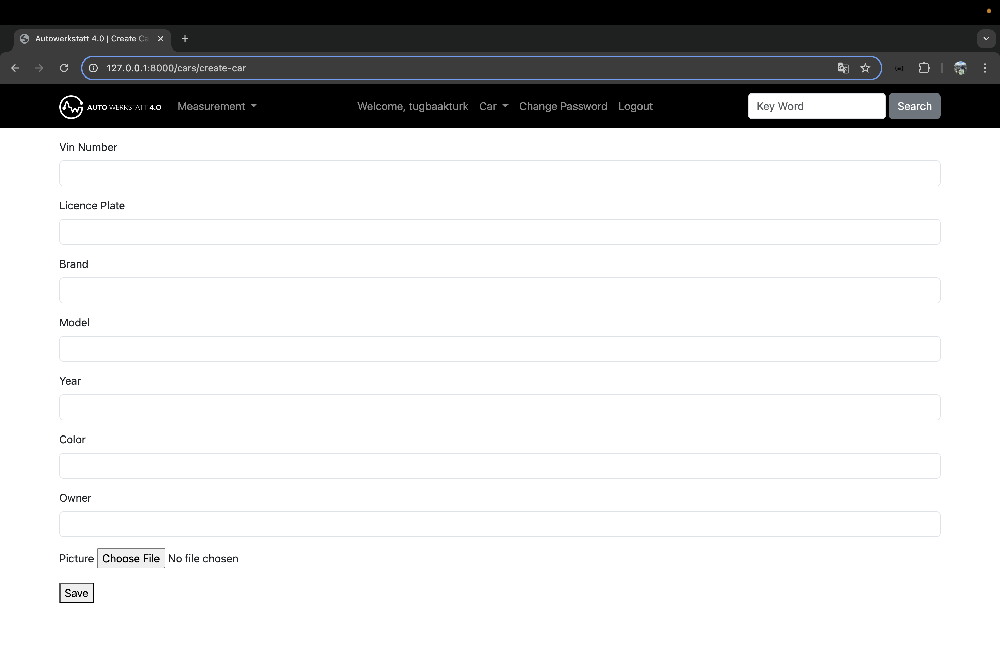
- **Edit Car**
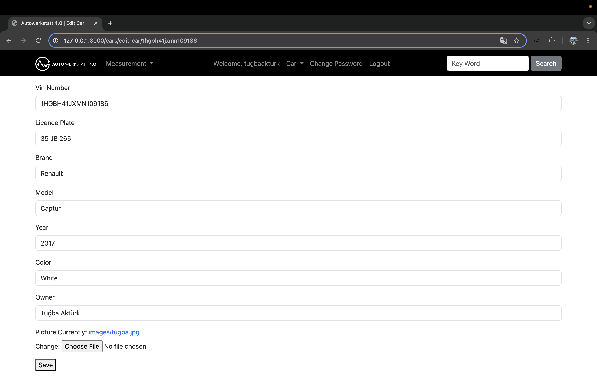
- **Delete Car**
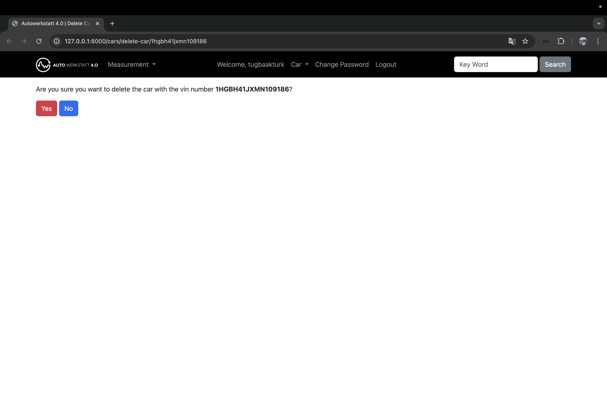
- **Car List**
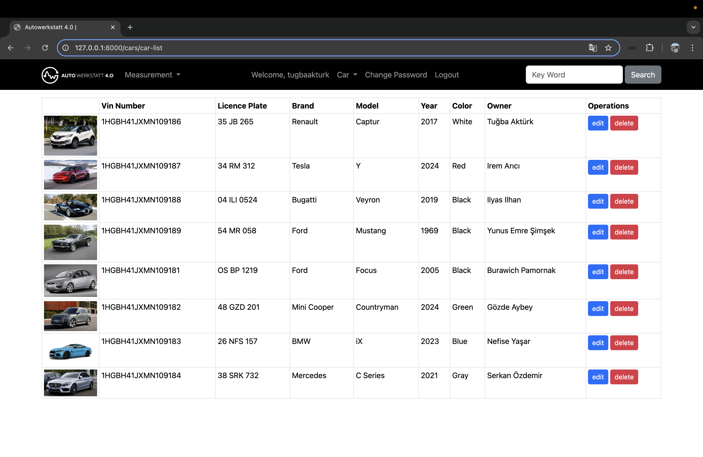

### 4) Measurement Management
- **Add Measurement**
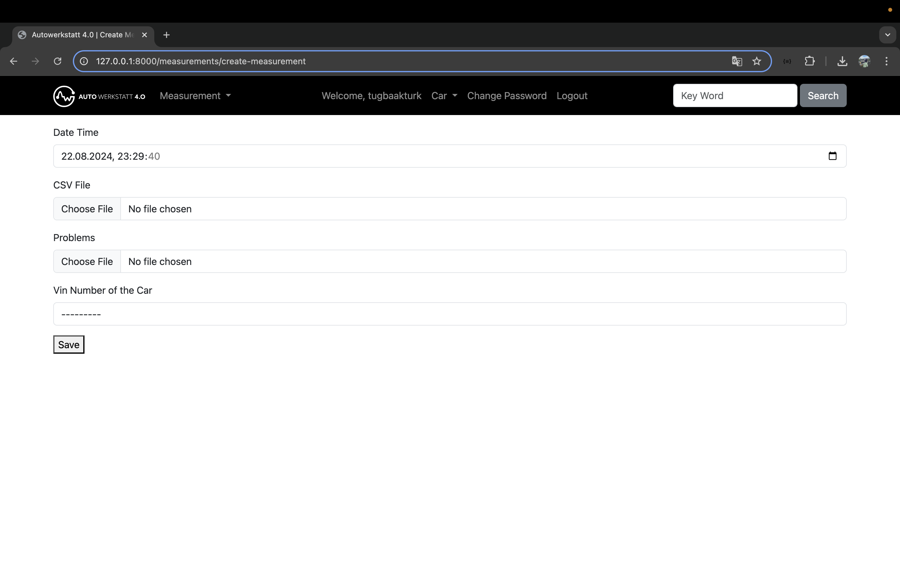
- **Edit Measurement**
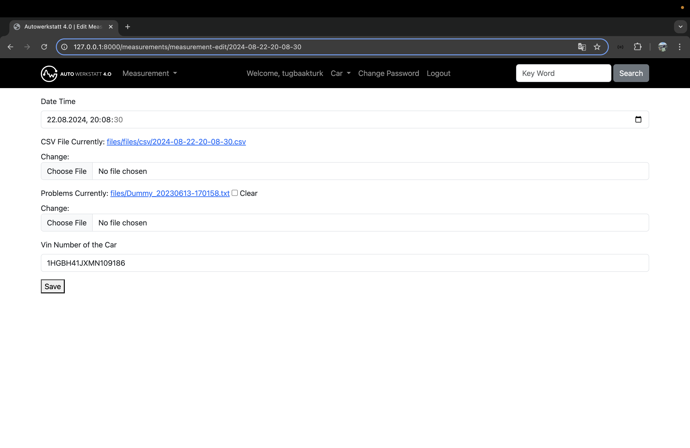
- **Delete Measurement**
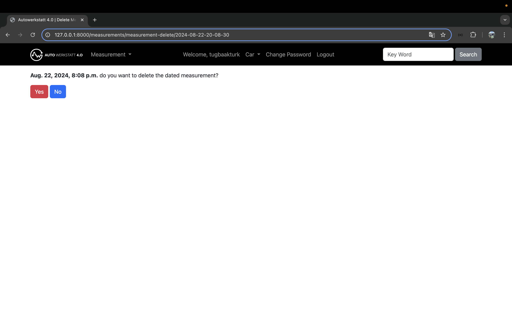
- **Measurement List**
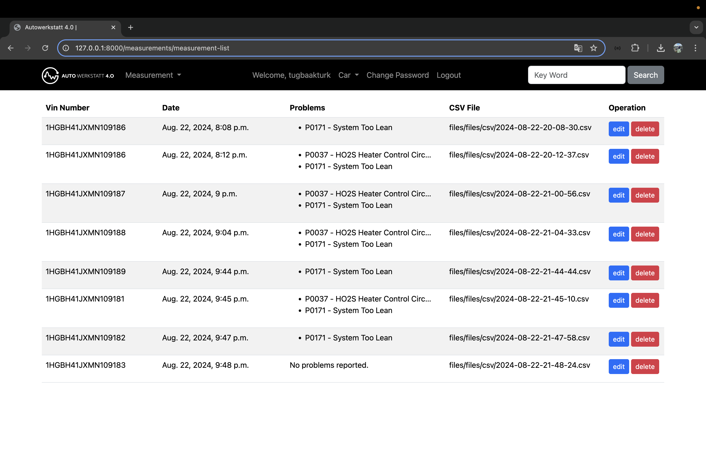
- **Measurement Detail (1)**
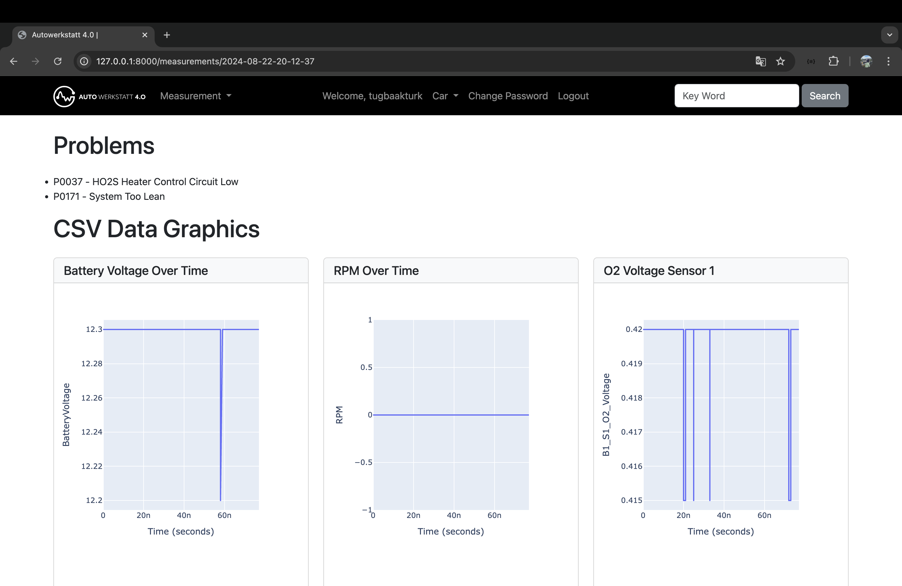
- **Measurement Detail (2)**

- **Measurement Detail (3)**
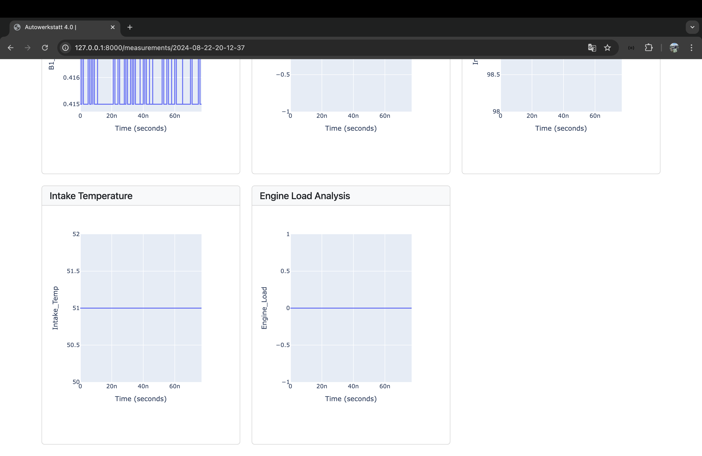

### 5) Profile & Security
- **Change Password**
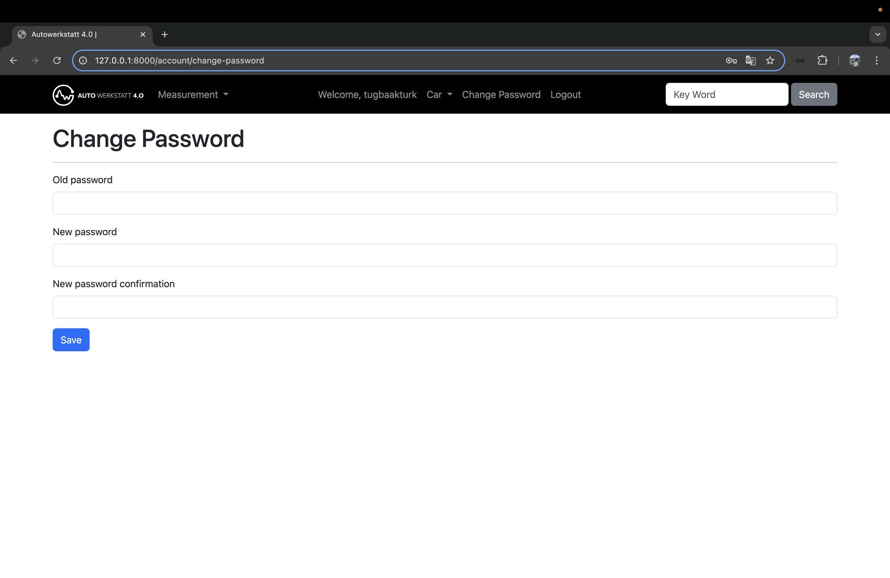

---

## ⚙️ Installation & Setup

### Prerequisites
- Python **3.10+**
- `pip` (and **virtualenv** recommended)
- Database (SQLite by default; PostgreSQL/MySQL optional)
- Git

### Steps
```bash
# 1) Clone the repository
git clone https://github.com/your-username/autowerkstatt.git
cd autowerkstatt

# 2) Create and activate virtual environment
python -m venv venv
# macOS/Linux
source venv/bin/activate
# Windows
venv\Scripts\activate

# 3) Install dependencies
pip install -r requirements.txt

# 4) Configure database in settings.py
# Update DATABASES according to your setup

# 5) Apply migrations
python manage.py makemigrations
python manage.py migrate

# 6) Create superuser
python manage.py createsuperuser

# 7) Run development server
python manage.py runserver

# Open the app in your browser:
# http://127.0.0.1:8000

```
---

## 📌 Future Enhancements
• **Multi-language support**
• **Advanced reporting & analytics**
• **Maintenance reminder notifications**
• **Improved mobile responsiveness**

---

## 🧑‍💻 Author
**Tuğba Aktürk**
Computer Engineering Student | Junior Software Developer
