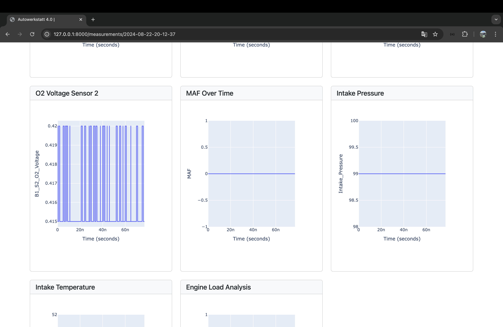

# Autowerkstatt Management System

Autowerkstatt is a comprehensive **car service management system** built with **Python Django**.  
It streamlines **car tracking**, **measurement recording**, **problem (DTC) management**, **user management**, and **reporting** with an intuitive web interface.

---

## 🚀 Features

### Authentication & Authorization

### Car Management

### Measurement Management

### Problem (DTC) Management

### Data Processing & Visualization

### UI & Templates

---

## 🛠️ Technologies

---

## 📸 Screenshots

### 1) Home Dashboard

### 2) User Authentication
- **Login**

- **Register**

### 3) Car Management
- **Add Car**

- **Edit Car**

- **Delete Car**

- **Car List**

### 4) Measurement Management
- **Add Measurement**

- **Edit Measurement**

- **Delete Measurement**

- **Measurement List**

- **Measurement Detail (1)**

- **Measurement Detail (2)**

- **Measurement Detail (3)**

### 5) Profile & Security
- **Change Password**

---

## ⚙️ Installation & Setup

### Prerequisites
- Python **3.10+**
- `pip` (and **virtualenv** recommended)

### Steps

---

---

## 🧑‍💻 Author
**Tuğba Aktürk**
Computer Engineering Student | Junior Software Developer
